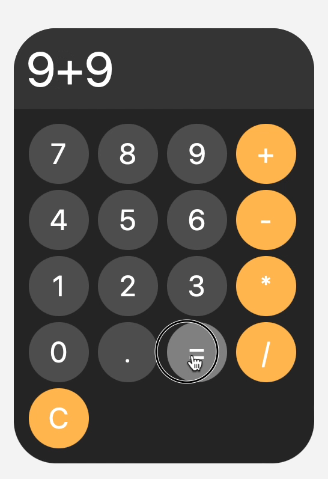

# Simple Calculator

A simple calculator that can perform basic arithmetic operations, built with CSS, HTML, and JavaScript.

Tutorial: [Build this JS calculator in 15 minutes!](https://www.youtube.com/watch?v=I5kj-YsmWjM&t=771s) by [Bro Code](https://www.youtube.com/@BroCodez)

## Demo

@2024-02-25